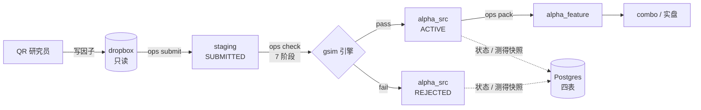
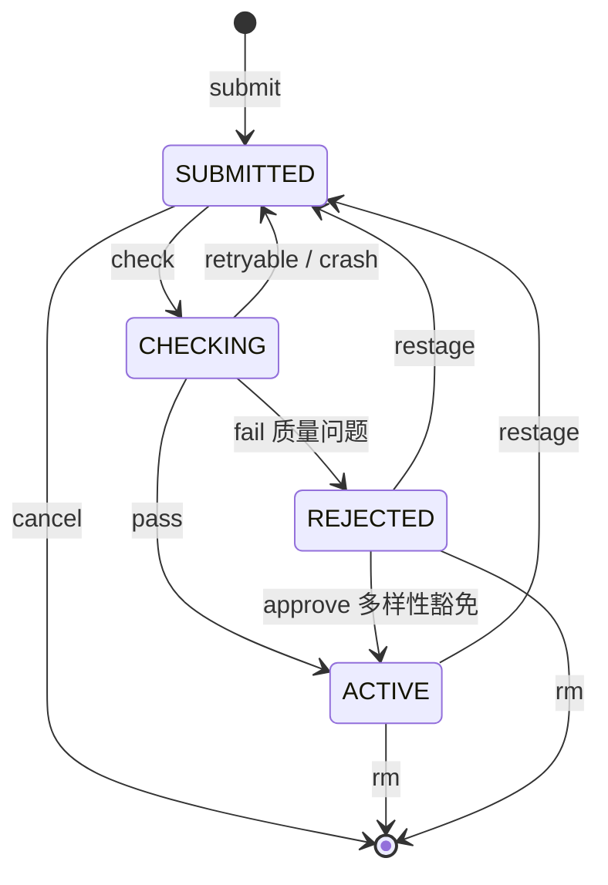
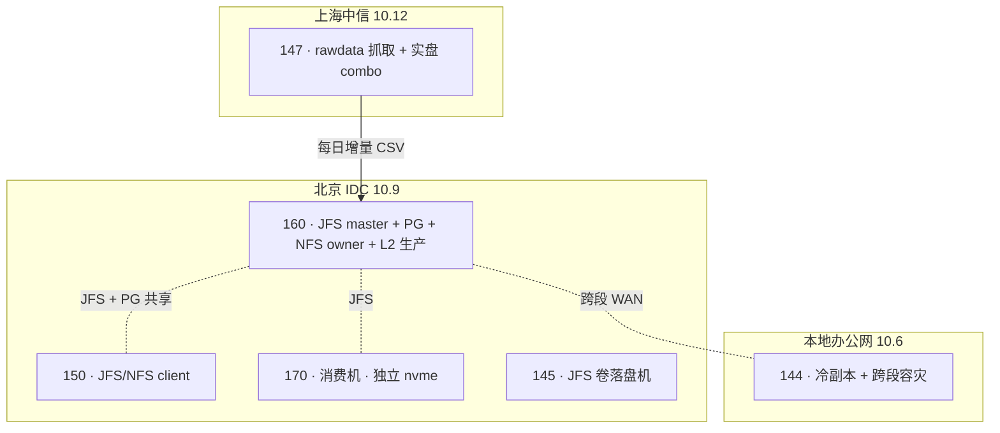

# ops 架构总览

自顶向下讲清整个系统怎么搭的。**这是地图不是深挖**:每节讲"是什么、为什么这么设计",
子部件详解见 [components/](components/),设计决策见 [design/](design/),更深处链接到
[根 CLAUDE.md](../CLAUDE.md) 与各模块 `CLAUDE.md`——不复制真相源。

## 两类读者

- **维护者 / 工程师**:通读全篇。
- **QR 研究员**:读 §1(全景)+ §3(生命周期与命令)+ §4(验证流水线)即可了解"因子提交后
  经历了什么";动手写因子看 [gsim/factor-workflow.md](gsim/factor-workflow.md) +
  [gsim/README.md](gsim/README.md)。

---

## 1. 它是什么 & 系统全景

**ops** 是一个 Python CLI,把量化 alpha 因子在进入生产因子库前要走的**验证 → 回测 →
归档 → 打包**编排成一条流水线,并管理因子的整个生命周期。它不是回测引擎——回测由外部的
**gsim** 做;ops 是编排者:决定哪些因子跑、跑什么、结果落哪、状态怎么变。

四个角色:**QR 研究员**(写因子,投到 dropbox)、**ops**(编排验证与归档)、**gsim**
(回测引擎,吃文件)、**combo / 实盘**(消费入库因子)。



**数据主干**:语义(身份/状态/表现)落 Postgres,重产物(源码/pnl/dump/feature)落
JuiceFS。这条"语义 ↔ 产物"分离贯穿全系统(§5)。

## 2. 代码分层

四层 + utils 叶子,依赖方向单向,由 import-linter **8 条契约 enforcing**(进 CI):


| 层 | 职责 | 锚点 |
|---|---|---|
| `cli/` | argparse 解析 + 终端渲染(rich) | `ops/main.py` 分发,`ops/cli/*.py` |
| `services/` | 用例编排(每个子命令一个包) | `ops/services/*/` |
| `core/` | 领域模型(Factor / 状态 / 路径 / metrics,纯,无 I/O) | `ops/core/*.py` |
| `infra/` | I/O 与外部系统(PG / JFS / gsim / lock / sudo) | `ops/infra/*.py` |
| `utils/` | 共享工具(叶子,谁都能引,不引别人) | `ops/utils/*.py` |

关键契约:C1 分层单向;C2 cli 不直引 infra/core(经 services);C3 各 service 包互相独立
(共享能力下沉 core);C9 渲染只在 cli(services/core 不引 rich)。新增子命令 = 在
`SUBPARSER_REGISTRARS` 加一行 + 注册处 `mark_write`(若写共享盘)。

→ 详见 [根 CLAUDE.md](../CLAUDE.md) 分层节 + [pyproject.toml](../pyproject.toml) 的 `[tool.importlinter]`。

## 3. 因子生命周期与命令

状态只有四值(与 DB `chk_status` 约束一一对应,DB 是权威):



**词汇表**(schema v3 正名,[design/schema-v3.md](design/schema-v3.md)):**在册**(有记录含被拒,`status != submitted`
= `ops list` 因子集)/ **在库**(ACTIVE,combo·bcorr 消费范围)/ **入库**(变为在库那一刻,
= entered 事件)/ **已入库**(至少入库过,`entered_at` 非空)。删除不是状态——因子要么存在
要么被 rm 删掉,无墓碑。

15 个命令按作用面分三组(一行 help 见 `ops <cmd> --help`):

| 组 | 命令 |
|---|---|
| 生命周期写 | `submit` `check` `restage` `approve` `cancel` `clear` `rm` |
| 读 / 查 | `list` `status` `info` |
| 产物 / 回测 | `run` `pack` `combo` |
| 运维 | `setup` `doctor` |

**破坏性操作一律 opt-in**(设计原则,§10):默认路径永不删用户数据,破坏性变体藏在
显式 flag 或独立子命令后。

→ 详见 [components/commands.md](components/commands.md)(15 命令 + 状态机 + 产物规则)。

## 4. 验证流水线(ops check)

`check` 对 staging 里每个因子顺序跑 7 个 stage(**stage 身份的唯一真相源是
`services/check/stages.py` 的 `PIPELINE` 元组**,新增 stage = 加一行):

| # | Stage | 作用 | 路由 |
|---|---|---|---|
| 0 | validate | 最小窗口回测,验证代码/配置能启动 | retryable |
| 1 | checkbias | 短回测 + AST 注入 `@DataFirewall`,检前视偏差 | reject |
| 2 | checkpoint | 断点续跑稳定性 | reject |
| 3 | long_backtest | 全历史回测(2015–2025) | retryable |
| 4 | compliance | 仓位约束(个股 ≤5%,多/空 ≥50,总 ≥100) | reject + 保产物 |
| 5 | correlation | 业绩门槛(ret/shrp/tvr)+ bcorr <0.7(否则须打败竞品) | reject + 保产物 |
| 6 | archive | 测得快照落库,搬入 alpha_src | — |

**路由三态**:retryable 失败(validate/long_backtest,多属环境问题)→ 回 SUBMITTED 留 staging,
下次 `ops check` 无条件重扫自动重试;其余失败 → REJECTED;compliance/correlation 失败额外
**保留 pnl+dump**(有分析价值)。异常归因按"当前正在跑的 stage"盖章(`CheckFail` 不携带
stage)。DataFirewall / checker 细节见 `ops/services/check/CLAUDE.md`。

**测得快照**(v3):correlation/compliance 失败也把测得指标写 `factor_snapshot`——所以被拒因子
在 `ops list` 也能看到 ret/shrp,不是只有入库因子有指标。

→ 详见 [components/check-pipeline.md](components/check-pipeline.md)(7 阶段 + 路由 + DataFirewall + 门槛)。

## 5. 存储三层分离(核心设计)

因子库本是三层被现状粘在一起的东西,**该分开**(`.claude/memory/project_factor_library_storage_architecture.md`):

| 层 | 落点 | 为什么 |
|---|---|---|
| 语义真相(身份/状态/表现) | **Postgres** | 多写(并发不高)+ 通用 + 未来可扩,OLTP 唯一全占 |
| 重型产物(feature/pnl/dump) | **JuiceFS** | gsim 只吃文件——这是 gsim 在一天就成立的边界 |
| 派生索引/分析 | **Postgres** | 可从一等数据重建 |

**JFS 收窄但不拆**:它只该给"文件耦合的 gsim"提供跨机一致文件视图,不该兼职元数据库。
**PG 是唯一真相源**:Redis 从"state 真相源"降级(2026-07 迁 PG),现只剩 JFS metadata 后端。
**健壮性铁律**:派生层任何东西都必须能从 JFS 一等数据(+PG)重建。

→ 详见 [components/data-model.md](components/data-model.md)(PG 侧)+ [components/storage-layout.md](components/storage-layout.md)(JFS 侧)。

## 6. 数据模型

**PG 四表**(server-160 docker, host 15432,全部 `id SERIAL` 主键 + `name UNIQUE`,无 library_id):

| 表 | 事实族 | 抽象层 |
|---|---|---|
| `factor_info` | 身份(author / discovery_method / created_at) | `infra/info/` |
| `factor_state` | 生命周期(status/version/时间戳) | `infra/store/` |
| `factor_snapshot` | 测得快照(metrics/datasources/delay/bcorr + snapshot_at) | `infra/snapshot/` |
| `factor_history` | 全操作审计事件(无 FK,活过 rm) | `infra/store/`(同模块) |

外键:state/snapshot 的 `name` 均 `REFERENCES factor_info(name) ON DELETE CASCADE`(删 info
级联)。`factor_history` **刻意无 FK**——审计要活过 `ops rm`。schema 演进(v2b 审计表 / v3
测得快照 / legacy 收口)见 [design/schema-v2.md](design/schema-v2.md) + [design/schema-v3.md](design/schema-v3.md)。

**Factor 聚合**(`core/factor.py`,全库唯一叫"因子"的类型):identity + state + snapshot +
last_fail(派生自事件表)四切面,由 **`FactorRepository`**(`infra/repository.py`)组装——
**service 层读写因子的唯一门面**(get/find/register/transition/attach_snapshot/delete/archive/
recall/purge_artifacts…)。find 是单条三表 LEFT JOIN,也是"库内因子集"定义处。

**SSOT 表**([根 CLAUDE.md](../CLAUDE.md)):每个事实族只有一个正主,其余是投影或缓存。改代码
第一问——**"你在问正主吗?"**

→ 详见 [components/data-model.md](components/data-model.md)(四表 + Factor 聚合 + Repository + SSOT)。

## 7. 盘面布局

生产数据共享在 JuiceFS 挂载点(`FactorPaths`,`core/paths.py`,是布局唯一正主——任何地方
不得再手写 `config.alpha_xxx / name`):

```
alphalib/
├── alpha_src/<name>/          源码目录      —— JFS 共享
├── alpha_pnl/<name>           pnl 单文件 ⚠  —— JFS 共享
├── alpha_dump/<name>/         日频持仓目录  —— 软链 → 本机 sidecar(唯一本机!)
├── alpha_feature/<name>.v{1,2}.npy  聚合矩阵 —— JFS 共享
└── staging/<name>/            在检因子      —— JFS 共享(队列消费)
```

布局事实由类型承载:src/staging/dump 是目录,pnl/池副本/feature 是**单文件**(删除用
`unlink` 不能 `rmtree`)。**五条路径唯一本机的是 alpha_dump**(大文件有意留本机 sidecar),
其余 + bcorr 分流池(`pnl_automated`/`pnl_manual`)全共享。挂载点各机不同(160/150 `/tank/`,
144 `/storage/`,170 `/nvme125/`),`/mnt/storage/alphalib` 是软链兜老路径。

→ 详见 [components/storage-layout.md](components/storage-layout.md)(五路径 + 软链 + 池 + 权限)。

## 8. 多机拓扑与并发

三地七机,跨段互通但带宽/延迟差异大:



- **JFS vs NFS 分工**:JFS 只服务 alphalib(因子库多机多写);cc / dm / L2 feature 走老 NFS
  (单 owner 多读)。两套分场景共存。
- **共享 staging + 队列消费**:任意机器 submit 入队,170 消费机 check,任意机器看结果。
- **跨机 `factor_lock`**:PG advisory lock(专用连接,session 级,断开自动释放)——per-machine
  fcntl 挡不住跨机对同一因子的并发变更;json dev/test 后端才用 fcntl。
- **sudo self-elevation**:共享路径 root-owned,写命令(`mark_write` 声明)自动 `sudo` 提权
  (`infra/sudo.py`);read-only 命令直通。
- **144 当 WAN 节点**:跨段路由,机器间传输脚本要调宽超时、避免 chatty 协议。

→ 详见 [components/topology.md](components/topology.md)(七机表 + JFS/NFS + 共享队列 + 锁 + sudo)。

## 9. 运维工具

两条命令兜"部署形态"与"数据一致性",哲学是**对账优于预防**:

- **`ops setup`**(声明式部署,"uv sync 之于部署"):config.yaml 的 hosts 块按 hostname 声明
  挂载点,`ops setup` 幂等补建缺失(目录/软链/权限组),`--check` 只读体检。**只创建缺失,
  绝不改动已存在**;声明变更收敛藏在 `--migrate-mount` 后。
- **`ops doctor`**(盘 ↔ PG 对账,8 族):缺省纯只读报告(零 sudo 零写);`--fix <族>` 逐族
  确认修复,走"五道闸"删除管道(锁内重验 / ACTIVE 绝缘 / 路径白名单 / 形态闸)——判定函数
  写错最多"该删没删",不可能升级为误删。前身 `ops health` 因"--fix 写没人读的僵尸表"退役。

→ 详见 [setup CLAUDE.md](../ops/services/setup/CLAUDE.md) + [doctor CLAUDE.md](../ops/services/doctor/CLAUDE.md)。

## 10. 设计原则

- **破坏性操作 opt-in**:默认非破坏,破坏路径藏 flag / 独立子命令 / 需显式授权到作用域。
- **SSOT**:每个事实族一个正主(SSOT 表),其余派生。改代码先问"你在问正主吗"。
- **crash 靠 staging 重扫自愈**:`ops check` 按 staging 目录扫(不看 state status),崩在半路的
  因子下次照样重跑;reconcile 已下线(state 共享 PG 后 per-host 视图无权裁决全局)。
- **迁移纪律**:dry-run 判读先行 / 备份先行 / 全部幂等 / apply 用新连接查库验证持久化 /
  沙盘实测(见 [remediation/](remediation/) 各 VERIFY 手册)。

## 11. 测试与门禁

- **分层**:`uv run pytest -m "not slow"`(快;控制流/状态/命令)/ `-m e2e`(真 gsim + cc,
  fake 因子在各 stage 确定性爆,~85s)。
- **PG 隔离**:测试库 `ops_test` 同实例,**per-session schema 隔离**(并行安全);不可达自动
  skip。见 [tests/README.md](../tests/README.md)。
- **门禁**:ruff + pyright + import-linter(8 契约)+ 快测,CI 常跑;PG service 在 CI 里跑。

## 12. 外部依赖与演进

- **gsim**(`/usr/local/gsim/`):回测引擎,一部分是 `.so` 二进制无源码控制,存在 147↔160
  代码/`.so` 双向漂移([incidents/](incidents/),待上级决策,本地不修)。ops 经 `infra/gsim/runner.py`
  shell out(run_backtest / run_simsummary / run_bcorr)。gsim 框架文档见 [gsim/](gsim/)。
- **cc 数据链**:rawdata(147 抓)→ 每日 CSV 同步北京 → 各地各跑 build_cc → gsim 直读
  `/datasvc/data/cc/`(memmap `.npy`)。因子数据源不信 XML `<Data>` 声明,解析 Python 的
  `dr.getData()`。
- **依赖**:numpy / xmltodict / pyyaml / loguru / rich / psycopg(见 `pyproject.toml`)。
- **演进史**:里程碑(Redis→PG / JFS 上线 / 三表重构 / schema v2·v3 / legacy 清理)见
  [根 CLAUDE.md](../CLAUDE.md) "已完成的大事件" + [.claude/plans.md](../.claude/plans.md) +
  [remediation/JOURNAL.md](remediation/JOURNAL.md)。路线图在 [.claude/plans.md](../.claude/plans.md)
  (下一批:compliance 判定重做,先测量后定策)。
