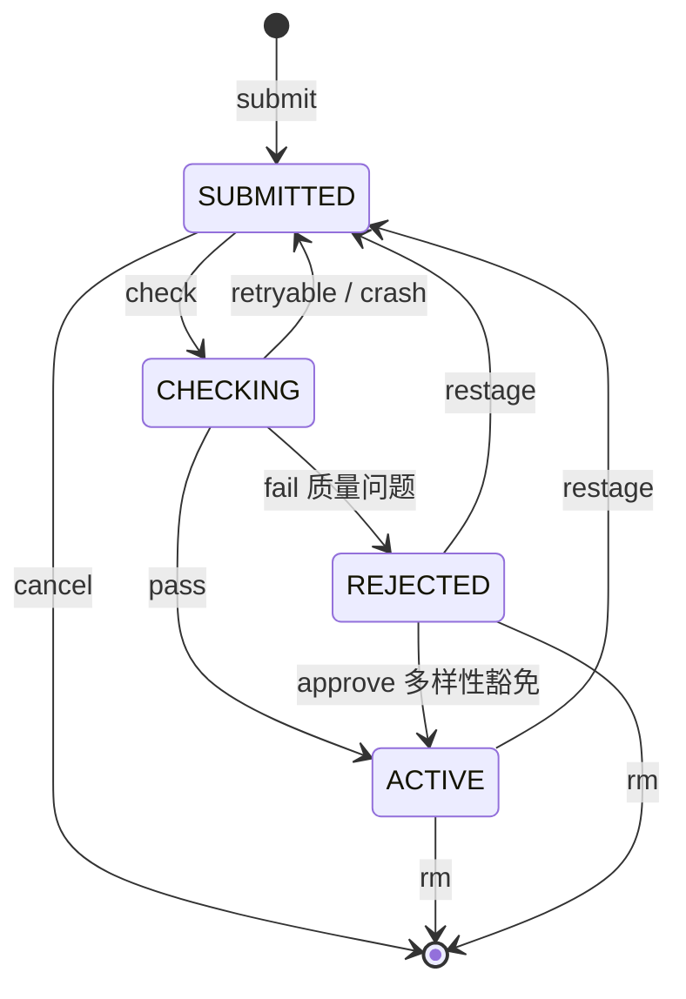

# 命令与生命周期

16 个子命令 + 因子状态机。一行 help 见 `ops <cmd> --help`;命令表(含中文语义)见
[`../../CLAUDE.md`](../../CLAUDE.md) 子命令表。

## 状态机

状态只有四值(与 DB `chk_status` 约束、`FactorStatus` 枚举一一对应,DB 是权威):

| 状态 | 业务含义 |
|---|---|
| SUBMITTED | 等待检测(唯一待审入口) |
| CHECKING | check 运行中的瞬态 |
| ACTIVE | 通过验证,在库因子 |
| REJECTED | 验证未通过 |

**没有 DELETED 状态**:因子要么存在(active/rejected/未来 decay 等),要么被 `ops rm` 彻底
删除而不存在——删除不是一种状态,无软删/墓碑。DECAYING/RETIRED 曾是 DB 拒收的幽灵状态,
2026-07-07 移除。

**词汇表**(schema v3,见 [`../design/schema-v3.md`](../design/schema-v3.md)):在册
(`status != submitted`)/ 已归档(盘面产物)/ 入库(动作,= entered 事件)/ 在库(ACTIVE)/
已入库(`entered_at` 非空)。不变量 `created_at <= submitted_at`。

## 命令

| 命令 | 语义 | 前置 | version |
|---|---|---|---|
| `submit` | 新因子从 dropbox 入 staging(默认跳过已入库) | 名不存在 | = 1 |
| `submit --overwrite` | 已入库因子改提新代码 | 名已存在 | += 1 |
| `check` | 对 staging 跑 6 stage + archive 段流水线 | staging 有目录 | — |
| `restage` | 召回 ACTIVE/REJECTED 到 staging 重跑 check(原代码不变) | ACTIVE/REJECTED | 不变 |
| `approve` | 多样性豁免:放行 correlation-rejected 因子 | REJECTED 且 last_fail=correlation | 不变 |
| `cancel` | 撤回未入库的 SUBMITTED(删 staging + 硬删 state) | SUBMITTED(--force 含 CHECKING) | — |
| `clear` | 清 staging 孤儿目录(state 无 record) | — | — |
| `rm` | 彻底删因子(src/pnl/dump/feature + factor_info 级联,不可逆) | 任意 | — |
| `list` / `status` / `info` | 查询(库内因子集 / 生命周期 / 单因子详情) | — | — |
| `run` / `pack` / `combo` | 回测 / 聚合 feature / combo 代测 | — | — |
| `produce` | 因子产线驱动:checkpoint 续跑日增(归档 XML 即生产态,dump/pnl 落 170 产线 dataset;--force 删 checkpoint 全段重跑须点名+确认) | ACTIVE | 不变 |
| `setup` / `doctor` | 部署补建 / 盘↔PG 对账 | — | — |

## 转移时数据产物规则

alpha_src 是所有因子的 src 归档(ACTIVE/REJECTED 都在,状态靠 state 区分,不靠目录位置)。

| 转移 | src | pnl | dump | feature |
|---|---|---|---|---|
| check pass → ACTIVE | staging 移入 | 新产出 | 新产出 | 无(需 ops pack) |
| check 失败 checkbias/checkpoint → REJECTED | 保留 | 清 | 清 | 无 |
| check 失败 compliance/correlation → REJECTED | 保留 | 保留 | 保留 | 无 |
| restage ACTIVE → SUBMITTED | 移入 staging | 保留 | 保留(--purge 清) | 保留(--purge 清) |
| restage REJECTED → SUBMITTED | 移入 staging | 清 | 清 | 清 |
| approve REJECTED → ACTIVE | 保留 | 保留 | 保留 | 保留 |
| submit --overwrite | 新代码到 staging,旧 src 保留 | 保留 | 保留 | 保留 |

要点:restage 是 `shutil.move` 非拷贝(召回后 staging 是 src 唯一副本,故 cancel 用 entered_at
守卫拒绝曾入库因子);ACTIVE restage 保留产物不暂停生产;approve 仅 correlation 失败(产物已
完整,翻状态即可)。

## 破坏性操作 opt-in(设计原则)

默认行为永不删用户数据。每个破坏性路径藏在显式 flag 或独立子命令后,并需显式授权到作用域:

- `rm` 硬删在库因子(6 落点 + factor_info 级联);`cancel` 硬删 SUBMITTED 的 staging+state;
  `clear` 删 staging 孤儿;`submit --overwrite` 覆盖已注册因子;批量操作缺省 dry-run。
- 交互确认默认开,`-y` 跳过。

新增触碰文件/状态/远端的命令:默认走非破坏路径,破坏变体藏 flag,require 显式授权。

→ 回 [架构总览](../architecture.md#3-因子生命周期与命令)
